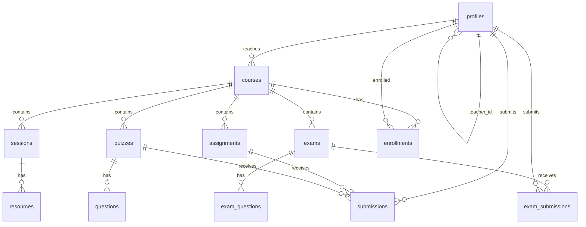

# Lumen LMS — Technical Documentation

A full-stack Learning Management System (LMS) MVP. Teachers create courses, assign students, and manage content; students access only enrolled courses; admins manage teachers platform-wide.

---

## Table of Contents

1. [Overview](#overview)
2. [Tech Stack](#tech-stack)
3. [Architecture](#architecture)
4. [Project Structure](#project-structure)
5. [Environment & Setup](#environment--setup)
6. [Authentication & Roles](#authentication--roles)
7. [Core Business Flows](#core-business-flows)
8. [Database Schema](#database-schema)
9. [Row Level Security (RLS)](#row-level-security-rls)
10. [Storage](#storage)
11. [API Layer](#api-layer)
12. [Routing](#routing)
13. [UI & State Management](#ui--state-management)
14. [SQL Migrations & Patches](#sql-migrations--patches)
15. [Demo Accounts & Seeding](#demo-accounts--seeding)

---

## Overview

| Item | Detail |
|------|--------|
| **Name** | Lumen LMS (`luman-lms`) |
| **Type** | Single-page application (SPA) |
| **Backend** | Supabase (PostgreSQL, Auth, Storage) |
| **Frontend** | React 19 + Vite 8 |
| **Deployment model** | Static frontend + managed Supabase backend |

### Design principles

- **Enrollment-based access** — Students see courses only when a teacher enrolls them (not by grade or subject).
- **Teacher isolation** — Each teacher sees only their own courses, students, exams, and submissions (enforced in app queries + RLS).
- **Defense in depth** — UI filters + Supabase RLS policies on every table.
- **No custom backend server** — All data access goes through `@supabase/supabase-js` from the browser.

---

## Tech Stack

| Layer | Technology |
|-------|------------|
| Build tool | Vite 8 |
| UI framework | React 19 |
| Routing | React Router v7 |
| Styling | Tailwind CSS v4 (`@tailwindcss/vite`) |
| Components | shadcn/ui (Radix UI primitives) |
| Icons | lucide-react |
| Charts (admin) | recharts |
| Database / Auth / Storage | Supabase |
| Linting | oxlint |

---

## Architecture

```
┌─────────────────────────────────────────────────────────────┐
│                     Browser (React SPA)                      │
│  ┌─────────────┐  ┌──────────────┐  ┌─────────────────────┐ │
│  │   Pages     │  │  Contexts    │  │  lib/api.js         │ │
│  │ (role-based)│  │ Auth/Theme/  │  │  lib/createUser.js  │ │
│  │             │  │ Toast        │  │  lib/supabase.js    │ │
│  └──────┬──────┘  └──────┬───────┘  └──────────┬──────────┘ │
│         └─────────────────┴────────────────────┘            │
│                            │                                 │
│                   @supabase/supabase-js                      │
└────────────────────────────┼────────────────────────────────┘
                             │ HTTPS (JWT in headers)
┌────────────────────────────▼────────────────────────────────┐
│                        Supabase                              │
│  ┌──────────┐  ┌──────────────┐  ┌────────────────────────┐ │
│  │   Auth   │  │  PostgreSQL  │  │  Storage (buckets)     │ │
│  │ (users)  │  │  + RLS       │  │  submissions, exam-img │ │
│  └──────────┘  └──────────────┘  └────────────────────────┘ │
└─────────────────────────────────────────────────────────────┘
```

### Request flow (example: student views courses)

1. Student logs in → Supabase Auth returns JWT.
2. `AuthContext` loads `profiles` row for `auth.uid()`.
3. `StudentCoursesPage` calls `fetchStudentCourses(studentId)`.
4. API queries `enrollments` → joins `courses` for enrolled course IDs.
5. RLS ensures student can only read enrollments and courses they are enrolled in.
6. UI renders `CourseCard` components.

---

## Project Structure

```
Luman-Lms/
├── src/
│   ├── main.jsx                 # App entry
│   ├── App.jsx                  # Route definitions
│   ├── index.css                # Global + Tailwind
│   ├── contexts/
│   │   ├── AuthContext.jsx      # Session, profile, sign-in/out
│   │   ├── ThemeContext.jsx     # Dark/light mode
│   │   └── ToastContext.jsx     # Notifications
│   ├── lib/
│   │   ├── supabase.js          # Supabase client (env vars)
│   │   ├── api.js               # Shared data-fetching helpers
│   │   ├── createUser.js        # User creation (teacher/admin)
│   │   ├── navigation.js        # Sidebar nav per role
│   │   └── utils.js             # Formatting helpers
│   ├── pages/
│   │   ├── auth/                # Login, forgot password
│   │   ├── admin/               # Super admin dashboard
│   │   ├── teacher/             # Teacher features
│   │   └── student/             # Student features
│   └── components/
│       ├── auth/                # ProtectedRoute, PublicRoute
│       ├── layout/              # DashboardLayout, Sidebar, Navbar
│       ├── shared/              # CourseCard, DataTable, forms…
│       └── ui/                  # shadcn primitives (Button, Card…)
├── supabase/
│   ├── migrations/              # Ordered schema + RLS (001–004)
│   ├── patches/                 # Incremental fixes for existing DBs
│   └── seeds.sql                # Demo data
├── .env                         # VITE_SUPABASE_URL, VITE_SUPABASE_ANON_KEY
├── package.json
├── vite.config.js
├── README.md                    # Quick start
└── DOCUMENTATION.md             # This file
```

---

## Environment & Setup

### Prerequisites

- Node.js 18+
- Supabase project ([supabase.com](https://supabase.com))

### Environment variables

Create `.env` in the project root:

```env
VITE_SUPABASE_URL=https://your-project.supabase.co
VITE_SUPABASE_ANON_KEY=your-anon-key
```

Values are in **Supabase → Project Settings → API**.

### Install & run

```bash
npm install
npm run dev      # Development (default http://localhost:5173)
npm run build    # Production build → dist/
npm run preview  # Preview production build
npm run lint     # oxlint
```

### Database setup (order matters)

Run in **Supabase SQL Editor**:

1. `supabase/migrations/001_initial.sql` — Tables, indexes
2. `supabase/migrations/002_database_logic.sql` — Functions, triggers, seed helpers
3. `supabase/migrations/003_security.sql` — RLS policies, storage policies
4. `supabase/migrations/004_enrollment_access.sql` — Enrollment-based student access
5. `supabase/patches/fix_teacher_data_isolation.sql` — Teacher-scoped data
6. `supabase/patches/exams_tables.sql` — Exam system tables
7. `supabase/patches/exam_course_submissions.sql` — Exams linked to courses + submissions
8. `supabase/patches/create_submissions_bucket.sql` — Storage bucket for file uploads

### Auth settings

**Authentication → Providers → Email**:

- Enable Email provider
- Enable email signup
- For development: **disable** “Confirm email” (or use Auto Confirm when creating users)

---

## Authentication & Roles

### Roles

| Role | `profiles.role` | Dashboard route |
|------|-----------------|-----------------|
| Super Admin | `super_admin` | `/admin` |
| Teacher | `teacher` | `/teacher` |
| Student | `student` | `/student` |

### Auth flow

1. **Login** — `signInWithPassword` via `AuthContext.signIn()`.
2. **Profile load** — Row fetched from `profiles` where `id = auth.uid()`.
3. **Disabled check** — If `profiles.disabled = true`, user is signed out immediately.
4. **Route guard** — `ProtectedRoute` checks `profile.role` against `allowedRoles`.
5. **Profile creation** — `handle_new_user()` trigger on `auth.users` INSERT creates/updates `profiles` from user metadata.

### User creation

| Creator | Method | File |
|---------|--------|------|
| Admin | Teacher CRUD | `createTeacher()` in `createUser.js` |
| Teacher | Student CRUD | `createStudent()` in `createUser.js` |
| Manual | Supabase Auth dashboard | Metadata: `role`, `full_name` |

`createUserAccount()` uses `signUp()` then restores the creator’s session so teachers/admins stay logged in.

Students get `teacher_id` set to the creating teacher’s UUID for data isolation.

---

## Core Business Flows

### Teacher flow

```
Create course → Add sessions/quizzes/assignments to course
     ↓
Add student → Assign one or more courses (creates enrollments)
     ↓
Create exam → Select course → Students enrolled in that course see it
     ↓
Grade work → Assignments tab (view uploaded files) + Exams tab (review answers)
```

| Feature | Page | Key behavior |
|---------|------|--------------|
| Courses | `/teacher/courses` | CRUD; fields: title, description, thumbnail |
| Course detail | `/teacher/courses/:id` | Sessions, quizzes, assignments |
| Quiz builder | `/teacher/courses/:id/quiz-builder` | MCQ quizzes per course |
| Assignments | `/teacher/assignments` | Create assignments linked to teacher’s courses |
| Students | `/teacher/students` | CRUD; course checkboxes create `enrollments` |
| Exams | `/teacher/exams` | Timed exams with MCQ + written questions |
| Grades | `/teacher/grades` | Assignment files + exam submission grading |

### Student flow

```
Login → See only enrolled courses
     ↓
Course detail → Sessions (video) → Quizzes → Assignments → Exams
     ↓
Upload assignment files → Teacher grades in Grades page
     ↓
Take exam (during start/end window) → MCQ auto-graded; written needs teacher review
```

| Feature | Page | Key behavior |
|---------|------|--------------|
| Courses | `/student/courses` | Lists courses from `enrollments` only |
| Lessons | `/student/courses/:id/lesson/:sessionId` | Video + progress tracking |
| Quizzes | `/student/courses/:id/quiz/:quizId` | Timed MCQ; auto-scored |
| Assignments | `/student/assignments` | File upload to Storage |
| Exams | `/student/courses/:id/exam/:examId` | MCQ + written; one submission per exam |

### Admin flow

| Feature | Page | Key behavior |
|---------|------|--------------|
| Dashboard | `/admin` | Stats charts (teachers, students, courses) |
| Teachers | `/admin/teachers` | CRUD teachers; education level, subjects |
| Settings | `/admin/settings` | Placeholder settings UI |

---

## Database Schema

### Core tables

#### `profiles`

Extends `auth.users`. One row per user.

| Column | Purpose |
|--------|---------|
| `id` | PK, FK → `auth.users` |
| `role` | `super_admin`, `teacher`, `student` |
| `full_name`, `first_name`, `last_name`, `email`, `phone` | Identity |
| `teacher_id` | FK → teacher profile (students only) |
| `education_level`, `secondary_track`, `subjects` | Teacher metadata (admin form) |
| `disabled` | Blocks login when `true` |

#### `courses`

| Column | Purpose |
|--------|---------|
| `title`, `description`, `thumbnail` | Course info |
| `teacher_id` | Owning teacher |

> Legacy columns `subject` and `grade` exist but are unused by the current app.

#### `enrollments`

Links students to courses. **This is the primary access control for students.**

| Column | Purpose |
|--------|---------|
| `student_id`, `course_id` | Unique pair |
| `progress` | 0–100% completion |

#### `sessions` → `resources`

Ordered video lessons per course. `locked` gates sequential access; completing a session unlocks the next.

#### `quizzes` → `questions`

In-course MCQ quizzes with timer, passing score, and attempt limits.

#### `assignments`

Course homework with due dates. Student uploads go to Storage; metadata in `submissions`.

#### `submissions`

| Target | Columns used |
|--------|--------------|
| Quiz | `quiz_id`, `answers`, `score`, `status` |
| Assignment | `assignment_id`, `file_url`, `score`, `status` |

#### `exams` → `exam_questions` → `exam_submissions`

Separate exam system (not the same as in-course quizzes).

| Table | Purpose |
|-------|---------|
| `exams` | Title, `course_id`, `teacher_id`, `start_date`, `end_date` |
| `exam_questions` | `type`: `mcq` or `written`; MCQ has `options`, `correct_index` |
| `exam_submissions` | Student answers (JSONB), `mcq_score`, `final_score`, `status` |

**Exam grading logic:**

- **MCQ-only exam** → `status = auto_graded`, `final_score` set on submit.
- **Written or mixed** → `status = submitted`; teacher sets `final_score` in Grades → Exams.

#### `session_progress`

Tracks per-student session completion; drives enrollment `progress` percentage.

#### `announcements`

Table exists in schema but the **UI feature was removed** (unused).

---

## Row Level Security (RLS)

RLS is enabled on all public tables. Policies use helper functions:

| Function | Returns |
|----------|---------|
| `get_user_role()` | Current user’s `profiles.role` |
| `get_user_grade()` | Current student’s grade (legacy) |
| `teacher_owns_course(uuid)` | Whether teacher owns a course |
| `student_enrolled_in_course(uuid)` | Whether student has enrollment row |

### Access matrix (simplified)

| Resource | Super Admin | Teacher | Student |
|----------|-------------|---------|---------|
| Own profile | ✓ | ✓ | ✓ |
| All profiles | ✓ | Own students only (`teacher_id`) | — |
| Courses | All | Own (`teacher_id`) | Enrolled only |
| Sessions, quizzes, assignments | All | Own courses | Enrolled courses |
| Enrollments | All | Own courses | Own rows |
| Submissions | All | Own course submissions | Own rows |
| Exams | All | Own (`teacher_id`) | Enrolled course exams |
| Exam submissions | All | Own course exams | Own rows |

### Teacher isolation

The policy `"Teachers view all courses"` was **removed**. Teachers now access courses only via `"Teachers manage own courses"` (`teacher_id = auth.uid()`).

Run `patches/fix_teacher_data_isolation.sql` on existing databases.

---

## Storage

| Bucket | Purpose | Path pattern |
|--------|---------|--------------|
| `submissions` | Assignment file uploads | `{userId}/assignments/{assignmentId}/{timestamp}-{filename}` |
| `exam-images` | Optional exam question images | `{examId}/{uuid}.{ext}` |

### Storage RLS

- Students upload/read only under their own `{userId}/` folder.
- Teachers can read all files in `submissions` bucket.
- Create bucket via `patches/create_submissions_bucket.sql`.

---

## API Layer

`src/lib/api.js` centralizes Supabase queries used across pages.

| Function | Purpose |
|----------|---------|
| `fetchStudentCourses(studentId)` | Enrolled courses with progress |
| `fetchStudentEnrolledCourseIds(studentId)` | Course ID list |
| `syncStudentEnrollments(studentId, courseIds)` | Create/delete enrollment rows |
| `fetchCourseWithDetails(courseId, studentId)` | Course tree + enrollment + progress |
| `fetchSession(sessionId)` | Session + resources |
| `markSessionComplete(...)` | Updates progress, unlocks next session |
| `fetchQuiz` / `submitQuiz` / `getQuizAttempts` | In-course quiz flow |
| `fetchTeacherCourses(teacherId)` | Teacher’s courses |
| `fetchAllTeachers` / `fetchAdminStats` | Admin dashboard |
| `fetchCourseExams(courseId)` | Exams for a course |
| `fetchExamForStudent` / `submitExamSubmission` | Exam take + grade |
| `gradeExamAnswers` | Client-side MCQ scoring helper |
| `getExamSubmission` | Check if student already submitted |

Many teacher pages also query Supabase directly with `.eq('teacher_id', user.id)` filters.

---

## Routing

Defined in `src/App.jsx`. All dashboard routes wrap `DashboardLayout` (sidebar + navbar).

### Public

| Path | Component |
|------|-----------|
| `/login` | LoginPage |
| `/forgot-password` | ForgotPasswordPage |

### Admin (`super_admin`)

| Path | Feature |
|------|---------|
| `/admin` | Dashboard |
| `/admin/teachers` | Teacher management |
| `/admin/settings` | Settings |

### Teacher (`teacher`)

| Path | Feature |
|------|---------|
| `/teacher` | Dashboard |
| `/teacher/courses` | Course list |
| `/teacher/courses/:courseId` | Course detail |
| `/teacher/courses/:courseId/quiz-builder` | Quiz builder |
| `/teacher/assignments` | Assignments |
| `/teacher/grades` | Grade assignments & exams |
| `/teacher/exams` | Exam list |
| `/teacher/exams/new` | Create exam |
| `/teacher/exams/:examId/edit` | Edit exam |
| `/teacher/students` | Student management |
| `/teacher/profile` | Profile |
| `/teacher/settings` | Settings |

### Student (`student`)

| Path | Feature |
|------|---------|
| `/student` | Dashboard |
| `/student/courses` | Enrolled courses |
| `/student/courses/:courseId` | Course detail |
| `/student/courses/:courseId/lesson/:sessionId` | Video lesson |
| `/student/courses/:courseId/quiz/:quizId` | Quiz |
| `/student/courses/:courseId/quiz/:quizId/result` | Quiz result |
| `/student/courses/:courseId/exam/:examId` | Take exam |
| `/student/courses/:courseId/exam/:examId/result` | Exam result |
| `/student/assignments` | Assignments |
| `/student/profile` | Profile |
| `/student/settings` | Settings |

---

## UI & State Management

### Contexts

| Context | Responsibility |
|---------|----------------|
| `AuthContext` | `user`, `profile`, `signIn`, `signOut`, `getDashboardRoute` |
| `ThemeContext` | Dark/light toggle (persisted) |
| `ToastContext` | Success/error notifications |

### Layout

- `DashboardLayout` — Responsive shell with collapsible `Sidebar` and `Navbar`.
- `NAV_ITEMS` in `navigation.js` — Role-specific sidebar links.
- `ProtectedRoute` — Auth + role + disabled-account checks.

### Shared components

| Component | Use |
|-----------|-----|
| `CourseCard` | Course thumbnail card with progress |
| `DataTable` | Sortable tables with empty states |
| `StudentForm` | Student create/edit with course assignment |
| `ConfirmDialog` | Delete confirmations |
| `SkeletonLoader` | Loading placeholders |

---

## SQL Migrations & Patches

### Migrations (fresh install — run in order)

| File | Contents |
|------|----------|
| `001_initial.sql` | All core tables, indexes, enable RLS |
| `002_database_logic.sql` | Auth trigger, RPCs, `seed_lumen_data()` |
| `003_security.sql` | RLS policies, storage policies, grants |
| `004_enrollment_access.sql` | Enrollment-based student course access |

### Patches (existing databases)

| Patch | When to run |
|-------|-------------|
| `add_teacher_id_to_students.sql` | `profiles.teacher_id` column missing |
| `fix_teacher_data_isolation.sql` | Teachers seeing other teachers’ data |
| `create_submissions_bucket.sql` | “Bucket not found” on assignment upload |
| `exams_tables.sql` | Exam tables missing |
| `exam_course_submissions.sql` | Exams need course link + submissions |
| `delete_user_account.sql` | Admin/teacher delete user fails |
| `teacher_student_update.sql` | Teacher cannot update student profiles |
| `update_user_email_direct.sql` | Email sync on student edit |
| `update_user_password_direct.sql` | Password sync on student edit |
| `teacher_profile_fields.sql` | first_name, last_name, phone columns |
| `teacher_education_fields.sql` | education_level, subjects on teachers |

---

## Demo Accounts & Seeding

### Create users (Supabase Auth → Users)

Enable **Auto Confirm User**. Password: `password123`.

| Email | Metadata |
|-------|----------|
| `superadmin@lumen.edu` | `{"full_name":"Admin User","role":"super_admin"}` |
| `teacher1@lumen.edu` | `{"full_name":"Dr. Sarah Chen","role":"teacher"}` |
| `teacher2@lumen.edu` | `{"full_name":"Mr. James Wilson","role":"teacher"}` |
| `student1@lumen.edu` | `{"full_name":"Alex Johnson","role":"student"}` |
| `student2@lumen.edu` | `{"full_name":"Emma Davis","role":"student"}` |
| `student3@lumen.edu` | `{"full_name":"Noah Brown","role":"student"}` |

### Seed data

Run `supabase/seeds.sql` after creating users. It:

1. Confirms demo user emails
2. Calls `seed_lumen_data()` which creates sample courses, sessions, quizzes, enrollments, and links students to teachers

---

## Data Model Diagram



---

## Production Checklist

- [ ] Set strong Supabase RLS policies (already in migrations)
- [ ] Enable email confirmation in production
- [ ] Revoke dev seed functions (`seed_lumen_data`, `sync_demo_profiles`)
- [ ] Use environment-specific Supabase project
- [ ] Build frontend: `npm run build` → deploy `dist/` to static host
- [ ] Configure CORS and redirect URLs in Supabase Auth settings
- [ ] Review storage bucket visibility (`submissions` is public for file URLs)

---

## Related Files

| File | Description |
|------|-------------|
| [README.md](./README.md) | Quick start guide |
| [supabase/README.md](./supabase/README.md) | Database-specific notes |

---

*Last updated to reflect enrollment-based access, exam system, teacher data isolation, and removal of the announcements UI.*
